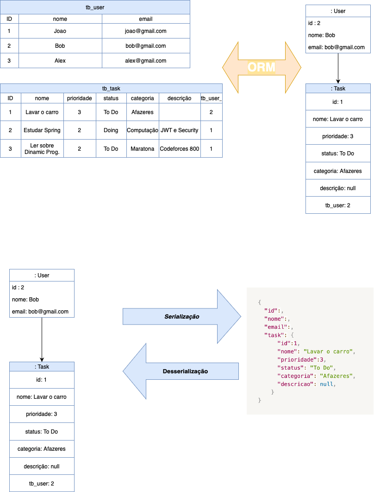

# To do List

## Visão geral do sistema:

Desenvolvimento de um sistema API REST de usuários e tasks, com os seguintes casos de uso:

- Buscar os usuários
- Buscar um usuários pelo sua id
- Inserir um novo usuário
- Listar Usuários
- Deletar Usuários
- Atualizar Usuários
- Inserir uma nova Task
- Buscar/Listar Tasks
    - por ID
    - por Nome
    - por Categoria
    - por Prioridades
    - por Status
- Deletar Task
- Atualizar Task

## Desenvolvimento Moderno : Relacional

## Dependências da Aplicação:

| Dependencies  | Version |
| --- | --- |
| Java | ≥ 11 |
| Groovy | ≥ 4.0 |
| PostgresSQL | ≥ 14.3 |
| Gradle | ≥ 5.1.1 |
| JUnit | ≥ 5.8.1 |

## Frameworks usados no Desenvolvimento:

| Frameworks  | Functions |
| --- | --- |
| Angular | Frontend |
| Spring | Backend - Microserviços |
| PostgresSQL | Manutenção do Banco de Dados |
| Spoc | Testes Unitários |
| Intellij  | IDE - Backend & BD |
| VScode | IDE - Frontend |
| Swagger  | Documentação das API’s |
| Git & GitHun  | Versionamento e Repositório Online |
